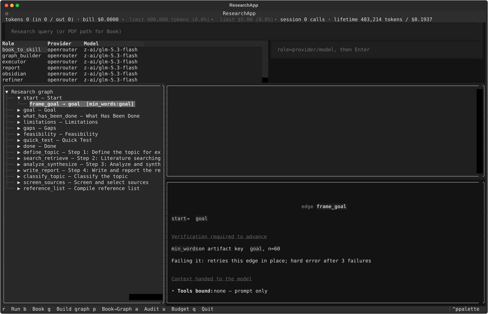
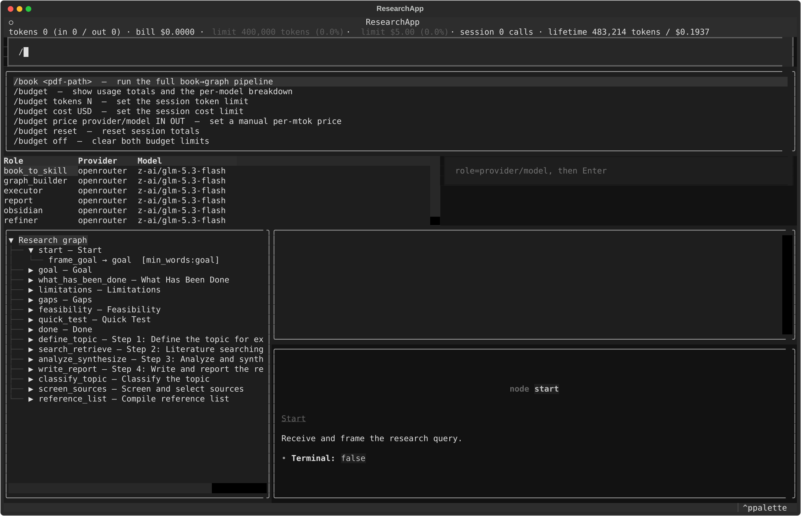

# Research Skill-Graph Agent

`ragent` turns a research-methodology document into an executable, audited procedure: a PDF is
extracted and segmented into chapters, chapters are distilled into skill Markdown and merged onto a
seed research-stage graph, `ragent graph audit` proves the graph is sound (no dead ends, every node
reaches `done`), and `ragent research` executes queries by walking that graph one metric-gated
transition at a time. Every step is appended to a JSONL trajectory that can be exported to CSV for
process-mining tools, and an offline, rollback-gated pipeline can propose graph edits from aggregated
trajectory statistics.

Document extraction uses the MIT-licensed [`virgiliojr94/book-to-skill`](https://github.com/virgiliojr94/book-to-skill)
package directly (`extract_single_file` and its extractor/sanitizer pipeline); `ragent` adds
role-configurable skill generation, the stage graph, the metric-gated executor, and the trajectory/
refinement tooling around it.

## Install

Requires Python >= 3.11 and Git.

```bash
python3 -m venv .venv
. .venv/bin/activate
pip install -e .
```

`pyproject.toml` pulls one dependency straight from GitHub:
`book-to-skill[pdf] @ git+https://github.com/virgiliojr94/book-to-skill.git@v1.4.0`. If that clone
fails with a TLS/network error, the failure is transient — re-run the same `pip install -e .`
command.

Installing registers the `ragent` console script (`[project.scripts] ragent =
"ragent.cli.main:entrypoint"`). The distribution is `research-skill-agent` version `0.1.0`.

## Credentials

`ragent` never reads a `.env` file. Each provider's API key comes from a plain environment variable
named by that provider's `api_key_env`:

| Provider | Env var | Required when |
|---|---|---|
| `openrouter` | `OPENROUTER_API_KEY` | any role routes through `openrouter` (the default for every role). |
| `openai` | `OPENAI_API_KEY` | a role is switched to `openai`. |
| `google` | `GOOGLE_API_KEY` | a role is switched to `google`. |
| Tavily search | `TAVILY_API_KEY` | `search.backend = "tavily"` (default backend is `ddg`, keyless). |

A missing key fails fast with the exact variable name: `provider '<name>' requires environment
variable <VAR>`. Providers never silently fall back to another provider or a cached response.

Practical note on OpenRouter keys: they are shaped `sk-or-v1-…`. Sending an OpenAI-format
`sk-proj-…` key to OpenRouter returns `401 Missing Authentication header`; sending a revoked or
unknown OpenRouter key returns `401 User not found`. Both are OpenRouter API responses, not `ragent`
errors — check `ragent providers check` output first.

## Quick start

```bash
ragent init                       # writes ragent.toml (if absent), .env.example, workspace dirs
ragent providers check            # pings every configured provider, prints role → provider/model
ragent book ./paper.pdf           # PDF -> .ragent/skills/{SKILL.md, chapters/*.md}
ragent graph build                # skills/ -> .ragent/graph.json (merged onto the seed graph)
ragent research "your query"      # walks the graph, writes .ragent/runs/<run_id>/
ragent tui                        # three-pane interactive UI
```

`ragent graph build`'s streamed output looks like this — one line per chapter, then the compiled
graph, its Mermaid rendering, the usage ledger status line, and the audit result:

```
chapter 1/6 01-front-matter.md
+2 nodes +1 edges (total 10/8)
chapter 2/6 02-introduction.md
+0 nodes +0 edges (total 10/8)
...
graph: .ragent/graph.json
mermaid: .ragent/graph.mmd
tokens 41,208 (in 33,114 / out 8,094) · bill $0.0000 · session 12 calls · lifetime 41,208 tokens / $0.0000
entry=start
done reachable from 10/10 nodes
dead ends: none
info: graph reachability and dead-end checks passed
```

`graph build` already runs the audit and exits with status 1 if it fails (writing
`graph.rejected.json` instead of `graph.json` — see [Workspace layout](#workspace-layout)) — a
separate `ragent graph audit` call is only needed to re-check a graph later.

## Workspace layout

Everything `ragent` writes lives under the configured `workspace` (default `.ragent/`, override with
`--workspace` or `RAGENT_WORKSPACE`):

```text
.ragent/
  skills/SKILL.md                          # synthesized end-to-end procedure
  skills/chapters/<NN>-<slug>.md           # one distilled chapter per source section
  graph.json                               # current compiled+audited stage graph
  graph.mmd                                # Mermaid rendering of graph.json
  graph.rejected.json                      # last build that failed audit (only written on failure)
  usage.json                               # lifetime + by-model token/cost ledger (budget.persist)
  graph_versions/<timestamp>/graph.json    # pre-merge graph snapshot, one per `refine merge` call
  runs/<run_id>/trace.jsonl                # append-only trajectory for one research run
  runs/<run_id>/artifacts/*.md             # per-stage artifacts written that run
  runs/<run_id>/report.md                  # final report, when report.generate ran
  refine/<timestamp>/proposal.json         # `refine propose` output
  refine/<timestamp>/rollback.json         # `refine rollback` (gated acceptance) output
```

## Configuration

`load_config` builds the effective config in this exact precedence, each step overlaying the last:

1. Built-in defaults (`DEFAULT_CONFIG` in `src/ragent/config.py`).
2. `ragent.toml` in the current directory, or the path given by `--config`.
3. Environment variable overlay (see table below).
4. `--model role=provider/model` overrides (repeatable).
5. `--workspace PATH`, applied last, unconditionally.

Global CLI flags: `--config PATH`, `--workspace PATH`, repeatable `--model role=provider/model`.

Seven roles are required — `book_to_skill`, `graph_builder`, `executor`, `report`, `obsidian`,
`refiner`, `judge` — each with its own `provider`/`model`/`temperature`/`max_tokens`. A config
missing any role fails with `missing role configuration: <roles>`; a role naming a provider not
under `[providers.*]` fails with `roles reference unknown providers: <names>`.

**Built-in defaults** (used for any role/field not set in `ragent.toml`): every role routes to
`openrouter` / `anthropic/claude-sonnet-4.5`, `temperature = 0.2`, `max_tokens = 8192`.

**This repo's checked-in `ragent.toml`**: every role routes to `openrouter` /
`z-ai/glm-5.3-flash`. `book_to_skill` and `graph_builder` additionally set `max_tokens = 16384` and
`temperature = 0.1` — the file's own comment explains why: `glm-5.3-flash` is a reasoning model that
spends completion tokens on chain-of-thought before the real chapter/JSON output; the largest chapter
in the bundled test PDF (17.8k source chars) needed 10.5k completion tokens, so 8192 measured empty
output and 16384 gives headroom. `executor`, `report`, `obsidian`, `refiner`, `judge` only override
`provider`/`model` in the checked-in file and inherit the default `temperature`/`max_tokens`.

**Illustrative multi-provider example** — mix providers per role, e.g. to keep the judge on a
cheaper/different model than the executor:

```toml
workspace = ".ragent"

[providers.openrouter]
kind = "openrouter"
api_key_env = "OPENROUTER_API_KEY"

[providers.openai]
kind = "openai"
api_key_env = "OPENAI_API_KEY"

[roles.executor]
provider = "openrouter"
model = "anthropic/claude-sonnet-4.5"

[roles.judge]
provider = "openai"
model = "gpt-5-mini"
temperature = 0.0
```

Other config sections:

```toml
[search]
backend = "ddg"                 # or "tavily"
api_key_env = "TAVILY_API_KEY"
max_results = 6

[obsidian]
backend = "vault"               # or "mcp"
folder = "Research"
mcp_command = []                # for MCP: ["node", "/path/to/server.js"]

[budget]
token_limit = 400000            # omit for unlimited
cost_limit_usd = 5.00           # omit for unlimited
warn_fraction = 0.8             # status line turns red at/above this fraction of a limit
persist = true                  # write usage.json; "session" totals are never persisted

[prices."openai/gpt-5-mini"]    # only needed for non-OpenRouter providers, or unpriced OpenRouter labels
input_per_mtok = 0.25
output_per_mtok = 2.00
```

Environment overlay variables: `RAGENT_WORKSPACE`, `RAGENT_SEARCH_BACKEND`,
`RAGENT_OBSIDIAN_VAULT_PATH`, `RAGENT_OBSIDIAN_FOLDER`, `RAGENT_MODEL_<ROLE>` (must be
`provider/model`, role name upper-cased), `RAGENT_BUDGET_TOKENS`, `RAGENT_BUDGET_COST_USD`.

One-off role override from the CLI:

```bash
ragent --model executor=openai/gpt-5-mini research "query"
```

## CLI command reference

| Command | Flags (defaults) | Notes |
|---|---|---|
| `ragent init` | — | Writes `ragent.toml` (if absent), `.env.example`, and `skills/`, `runs/`, `graph_versions/`, `refine/` under the workspace. |
| `ragent providers check` | — | Pings every configured provider's `/models` endpoint; prints provider status and a role → provider/model table; exits 1 if any provider failed. |
| `ragent book PDF` | `--out PATH`, `--force` | Extracts + segments the PDF and distills it into `skills/SKILL.md` + `skills/chapters/*.md`. `--force` bypasses the per-chapter and SKILL.md caches. |
| `ragent graph build` | `--skill-dir PATH`, `--out PATH`, `--no-extend` | Merges `skills/chapters/*.md` onto the seed graph; `--no-extend` returns the unmodified 8-node seed with no LLM calls. Writes `graph.json` + `graph.mmd`, or `graph.rejected.json` on audit failure. Exits 1 if the final audit fails. |
| `ragent graph show` | `--node TEXT`, `--graph PATH` | Prints a tree of one node (or all nodes) with its outward edges and their metrics. |
| `ragent graph audit` | `--graph PATH` | Re-runs the soundness audit on a saved graph; exits 1 on failure. |
| `ragent research QUERY` | `--graph PATH`, `--start TEXT`, `--max-steps N=24 (min 1)`, `--report/--no-report`, `--obsidian/--no-obsidian` | Executes the graph for one query. `--no-obsidian` strips `obsidian.note` from every edge's tool set. `--no-report` strips `report.generate` from every edge that has it, sets that edge's `produces = "publication"`, and swaps its metric to `artifact_exists` on `quick_test`. |
| `ragent runs list` | — | Table of run id, transition count, final target, newest first. |
| `ragent runs show RUN_ID` | — | Prints the raw JSONL trace as JSON, plus the report path if one was written. |
| `ragent runs export CSV_PATH` | — | Writes `case_id,activity,timestamp,step,edge_id,metric_passed` for process-mining tools. |
| `ragent refine propose` | — | Sends aggregated trajectory stats (not the graph, artifacts, or query text) to the `refiner` role; writes `refine/<ts>/proposal.json`. |
| `ragent refine merge PROPOSAL` | `--accept ID` (repeatable), `--all` | Applies selected proposal operations, snapshotting the current graph first; rejects if the merged graph fails audit. |
| `ragent refine rollback CANDIDATE` | — | Runs the gated-acceptance comparison (baseline vs. candidate graph over three fixed eval queries) and rolls back the candidate if it doesn't clear the acceptance thresholds. |
| `ragent tui` | — | Launches the interactive three-pane UI. |

Exit codes: expected failures (`RagentError` subclasses — `GraphError`, `MetricError`,
`ProviderError`, `BudgetError`) print `error: <message>` and return 1 from `entrypoint()`.
`providers check` and a failing graph build/audit exit 1 via a separate `typer.Exit(1)`. Malformed
CLI arguments or an invalid `--model` value are Typer usage errors, exit code 2.

See [algorithm.md](docs/algorithm.md) for exactly how `research` walks the graph and
[trajectories.md](docs/trajectories.md) for what `runs`/`refine` read and write.

## TUI reference

`ragent tui` launches a Textual app with:

- **Budget strip** (`#budget`) — the live `UsageLedger.status_line()`.
- **Query input** (`#query`) — placeholder `Research query (or PDF path for Book)`; also where slash
  commands are typed.
- **Command palette** (`#palette`) — hidden until the query input starts with `/`, then filtered as
  the command is typed.
- **Role table** (`#models`: Role / Provider / Model) next to the **model override input**
  (`#model_override`, placeholder `role=provider/model, then Enter`) — changes are in-memory only.
- **Graph tree** (`#graph`, 34% width) — nodes as `id — title`, edges as
  `edge_id → target  [metric_kind:metric_key]`; loaded from `.ragent/graph.json` if present, else the
  seed graph. Selecting any node or edge row renders its full contents (prompt template, bound
  tools, produced artifact key, gate metric, and `on_fail`) in the artifact pane.
- **Event log** (`#log`).
- **Artifact pane** (`#artifact`) — the newest artifact or selected graph row, rendered as Markdown.
- **Per-model breakdown table** (`#breakdown`: Model / Calls / In / Out / Total / Cost) — hidden
  until toggled with `u` or `/budget`.

### TUI screenshots

Selecting an edge exposes its gate, retry behavior, context, tools, and prompt:



Typing `/` opens the filtered command palette:



Key bindings:

| Key | Action | Behavior |
|---|---|---|
| `r` | Run | Reads `#query` as the research query. A leading `/` logs `slash commands run on Enter, not r` instead of running. Empty input logs `enter a research query`. |
| `b` | Book | Treats `#query` as a PDF path and runs book distillation *without* progress streaming. A missing/invalid path logs `Book binding uses the query field as a PDF path`. |
| `g` | Build graph | Rebuilds `graph.json` from `skills/` with no progress streaming. Unlike the CLI, this writes no `graph.mmd` and prints no audit. |
| `p` | Book→Graph | Runs the full book→graph pipeline, but only if `#query` already holds a PDF path; otherwise logs `pipeline: type /book <pdf-path> and press Enter`. |
| `a` | Audit | Audits the currently loaded (or seed) graph and logs every finding. |
| `u` | Budget | Toggles the `#breakdown` table and refreshes it. |
| `q` | Quit | — |

Slash commands (typed into `#query`, submitted with Enter):

Typing `/` opens the palette, filtered as you type. `up`/`down` move the
highlight, `tab` completes the highlighted command into the query box,
`escape` dismisses it, clicking an entry completes it, and `enter` still
submits.

- `/book <pdf-path>` — runs the full book→graph pipeline with live per-chapter log lines. The graph
  tree resets to the seed and grows live as each `graph_delta` arrives. On completion it writes
  `graph.json` (or `graph.rejected.json` if the audit fails), always writes `graph.mmd`, and shows
  the Mermaid source in the artifact pane. The path is split on whitespace (`raw.split()`), so paths
  containing spaces are not supported.
- `/budget` — prints the status line and a per-model breakdown; also shows the `#breakdown` table.
- `/budget tokens N` — sets the session token limit (in memory only).
- `/budget cost USD` — sets the session cost limit (in memory only).
- `/budget price provider/model IN OUT` — sets a manual per-mtok price for a label.
- `/budget reset` — resets session totals only (lifetime totals in `usage.json` are untouched).
- `/budget off` — clears both limits.
- Any other `/…` prints the two help lines: the budget usage summary and `/book <pdf-path>`.

`/budget` and `#model_override` edits never write `ragent.toml` — they only mutate the in-memory
`Config`/`UsageLedger` for the current TUI session.

The command palette is the discoverable path for slash commands. The `p`
binding still only works when a PDF path is already sitting in `#query`;
otherwise use `/book <pdf>` and Enter.

## Budgets and cost control

One `UsageLedger` per resolved workspace path is shared by every `get_llm` call across the CLI and
TUI in a process. Every LLM call runs `precheck()` against **session** totals before the request and
`record()` only after a successful response — so a budget only stops the *next* call, not a
mid-flight one. `usage.json` persists lifetime and by-model totals (when `budget.persist = true`,
the default); the `session` counter itself is never persisted and resets every process.

Only `openrouter` reports real USD cost per call (`usage.include` in the request payload). Any other
provider's spend shows as `... calls unpriced (set /budget price)` and does not count toward
`cost_limit_usd` unless you add a `[prices."<provider>/<model>"]` entry.

Demonstrated behavior: `RAGENT_BUDGET_COST_USD=0.000001 ragent book ./paper.pdf --force` completes
one chapter (the call that pushes session cost past the tiny limit still completes and is recorded),
then the next LLM call's `precheck()` blocks with `error: cost budget reached: ...` and the process
exits 1.

See [algorithm.md](docs/algorithm.md) for the exact `BudgetError` message templates and
`status_line()` format.

## Further reading

- [docs/algorithm.md](docs/algorithm.md) — the executor's run loop, tool loop, metric kinds, and budget enforcement.
- [docs/skill-graph.md](docs/skill-graph.md) — what a skill graph is, the shipped seed, its schema, and its soundness rules.
- [docs/trajectories.md](docs/trajectories.md) — trajectory records, export/aggregation, and offline graph refinement.
- [docs/book-to-skill.md](docs/book-to-skill.md) — PDF extraction, chapter segmentation, distillation, and the chapter→graph merge.
- [docs/README.md](docs/README.md) — index of the above.
